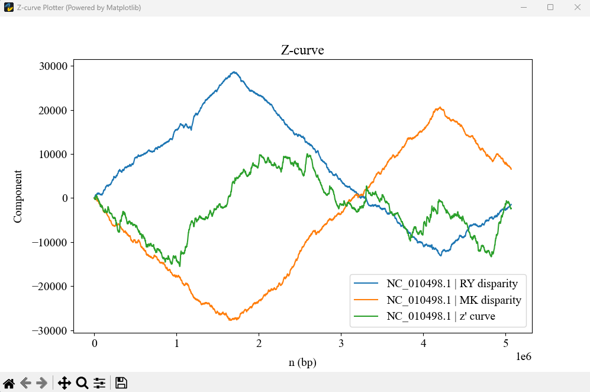
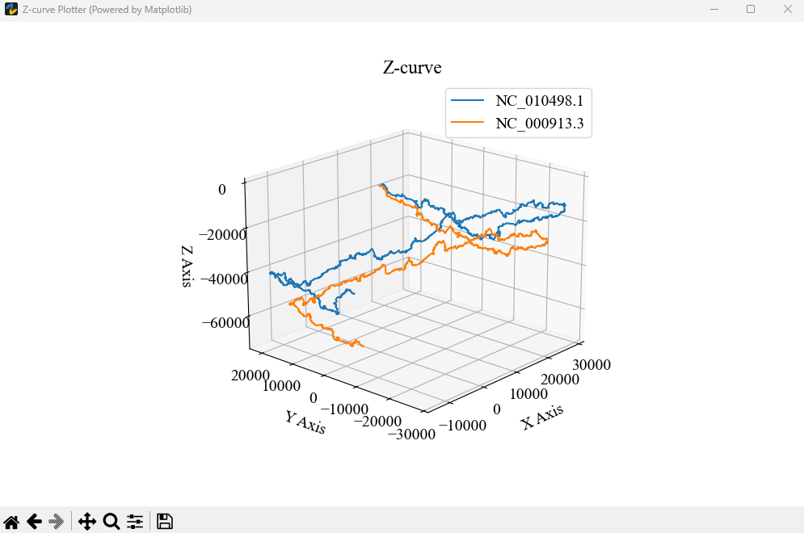

# Commandline
In order to meet the needs of more users, especially those who are not good at Python, we also equipped ZCurvePy with a series of command line programs that are basically consistent with APIs and Web Server functionality. In some ways, command line programs are more powerful than API interfaces, such as convenient visual interfaces and easy-to-write setting files as JSON. 
## Contents
- [Z-curve Plotter](#z-curveplotter)
- [Z-curve Encoder](#z-curve-encoder)
- [Z-curve Segmenter](#z-curve-segmenter)
## Z-curve Plotter
This is the executable command line version of ZCurvePlotter, which integrates sequence download, cropping, complementary sequence transformation, multi-curve visualization, and more.  

**Usage:**  
2D-mode :
```bash
zcurve-plotter [-h] [-f FASTA] [-g GENBANK] [-a ACCESSION] -s SETTINGS [-o OUTPUT]  [-p PNG] [-v SHOW]
```
3D-mode :
```bash
zcurve-plotter-3d [-h] [-f FASTA] [-g GENBANK] [-a ACCESSION] -s SETTINGS [-o OUTPUT]  [-p PNG] [-v SHOW]
```
**Args:**  
|Short Arg|Long Arg   |Discription                                               |Example             |
|:-------:|:----------|:---------------------------------------------------------|:-------------------|
|-h       |--help     |show this help message and exit                           |-h                  |
|-f       |--fasta    |input genome files as FASTA format (*.fa; *.fasta; *.fna) |-f genome.fa        |
|-g       |--genbank  |input genome files as GenBank format (*.gb; *.gbk; *.gbff)|-g genome.gb        |
|-a       |--accession|input as NCBI accession number (comma-splited; *.txt)     |-a NC_000854.2      |
|-s       |--settings |external setting file as JSON format (*.json)             |-s settings.json    |
|-o       |--output   |output data file of all curves as JSON (*.json)           |-o curves.json      |
|-p       |--png      |output graphic file as PNG picture (*.png)                |-p picture.png      |
|-v       |--show     |show graphic user interface or not (default: False)       |-v True             |

**JSON:**  
```json
{
    /* 
     * All of ZCurvePy's command line programs can share a single settings.json,
     * so the application should be specifed as "plotter" at first.
     */
    "plotter": [
        /* Specify parameters for each drawing task in turn through a list. */
        { // The first nucleic sequence to plot
            "start": 114514,  // Start plotting point
            "stop": 1919810,  // Stop plotting point
            "comp": true, // Plot complement sequence
            "window": 1000, // Window size 
            "intv": 10, // Function fetch point interval
            "curve2d": "RY,MK,ZP",  // CTL curve codes
            /* You can specify multiple 2D curves to draw for 
             * each sequence and display them in a single image.
             * The curve code is shown in the table below.
             */
            "curve3d": "RY:MK:ZP"  // CTL curve codes
            /* You can choose three of the 11 curves as the x 
             * component, the y component and the z component.
             *  The curve code is shown in the table below.
             */
        }, { // The second nucleic sequence to plot
            ...
        },
        ...
    ]
}
```

| No. |Name                     |Mathematical Expression                             | Curve Code |
|:---:|:-----------------------:|:---------------------------------------------------|:----------:|
| 1   |RY disparity             |$x_{n}=(A_{n}+G_{n})-(C_{n}+T_{n}), n=1,2,3...N$    |RY          |
| 2   |MK disparity             |$y_{n}=(A_{n}+C_{n})-(G_{n}+T_{n}), n=1,2,3...N$    |MK          |
| 3   |WS disparity             |$z_{n}=(A_{n}+T_{n})-(G_{n}+C_{n}), n=1,2,3...N$    |WS          |
| 4   |AT disparity             |$d_{\rm AT}(n)=A_{n}-T_{n}, n=1,2,3...N$            |AT          |
| 5   |GC disparity             |$d_{\rm GC}(n)=G_{n}-C_{n}, n=1,2,3...N$            |GC          |
| 6   |x' curve                 |$x_{n}^{'}=x_{n} - kn, n=1,2,3...N$                 |XP          |
| 7   |y' curve                 |$y_{n}^{'}=y_{n} - kn, n=1,2,3...N$                 |YP          |
| 8   |z' curve                 |$z_{n}^{'}=z_{n} - kn, n=1,2,3...N$                 |ZP          |
| 9   |AT' curve                |$d_{\rm AT}^{'}(n)=d_{\rm AT}(n) - kn, n=1,2,3...N$ |AP          |
| 10  |GC' curve                |$d_{\rm GC}^{'}(n)=d_{\rm GC}(n) - kn, n=1,2,3...N$ |GP          |
| 11  |CpG profile              |$z_{n}=2{CpG}_{n} - (k + 1)n, n=1,2,3...N$          |CG          |

**Examples:**
```bash
zcurve-plotter -a NC_010498.1 -s settings.json -o output.json -p curve.png -v True
```

```bash
zcurve-plotter-3d -a NC_010498.1,NC_000913.3 -s settings.json -o output.json -p curve.png -v True
```

## Z-curve Encoder <a id="z_curve_encoder"></a>