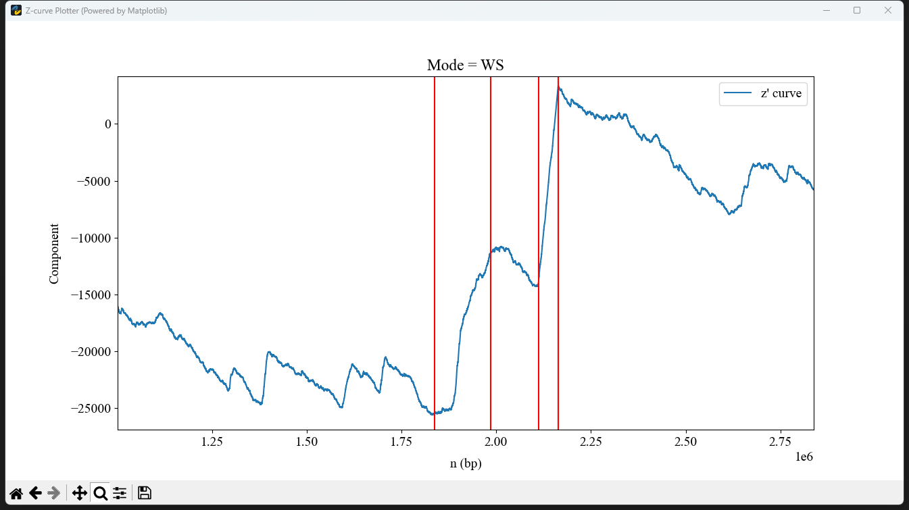

# Commandline
In order to meet the needs of more users, especially those who are not good at Python, we also equipped ZCurvePy with a series of command line programs that are basically consistent with APIs and Web Server functionality. In some ways, command line programs are more powerful than API interfaces, such as convenient visual interfaces and easy-to-write setting files as JSON. 
## Z-curve Plotter
This is the executable command line version of ZCurvePlotter, which integrates sequence download, cropping, complementary sequence transformation, multi-curve visualization, and more.  

**Usage:**  
2D-mode :
```bash
zcurve-plotter [-h] [-f FASTA] [-g GENBANK] [-a ACCESSION] -s SETTINGS [-o OUTPUT]  [-p PNG] [-v SHOW]
```
3D-mode :
```bash
zcurve-plotter-3d [-h] [-f FASTA] [-g GENBANK] [-a ACCESSION] -s SETTINGS [-o OUTPUT]  [-p PNG] [-v SHOW]
```
**Args:**  
|Short Arg|Long Arg   |Discription                                               |Example             |
|:-------:|:----------|:---------------------------------------------------------|:-------------------|
|-h       |--help     |show this help message and exit                           |-h                  |
|-f       |--fasta    |input genome files as FASTA format (*.fa; *.fasta; *.fna) |-f genome.fa        |
|-g       |--genbank  |input genome files as GenBank format (*.gb; *.gbk; *.gbff)|-g genome.gb        |
|-a       |--accession|input as NCBI accession number (comma-splited; *.txt)     |-a NC_000854.2      |
|-s       |--settings |external setting file as JSON format (*.json)             |-s settings.json    |
|-o       |--output   |output data file of all curves as JSON (*.json)           |-o curves.json      |
|-p       |--png      |output graphic file as PNG picture (*.png)                |-p picture.png      |
|-v       |--show     |show graphic user interface or not (default: False)       |-v True             |

**JSON Setting File**  
```json
{
    /* 
     * All of ZCurvePy's command line programs can share a single settings.json,
     * so the application should be specifed as "plotter" at first.
     */
    "plotter": [
        /* Specify parameters for each drawing task in turn through a list. */
        { // The first nucleic sequence to plot
            "start": 114514,  // Start plotting point
            "stop": 1919810,  // Stop plotting point
            "comp": true, // Plot complement sequence
            "window": 1000, // Window size 
            "intv": 10, // Function fetch point interval
            "curve2d": "RY,MK,ZP",  // CTL curve codes
            /* You can specify multiple 2D curves to draw for 
             * each sequence and display them in a single image.
             * The curve code is shown in the table below.
             */
            "curve3d": "RY:MK:ZP"  // CTL curve codes
            /* You can choose three of the 11 curves as the x 
             * component, the y component and the z component.
             *  The curve code is shown in the table below.
             */
        }, { // The second nucleic sequence to plot
            ...
        },
        ...
    ]
}
```
Note:  
1. Param 'intv' must be given or the visualizing module will throw an 'Divided By Zero' exception.
2. Param 'curve2d' must be given for command `zcurve-plotter` or a error will happen;  
   Param 'curve3d' must be given for command `zcurve=plotter-3d` or a error will happen.

| No. |Name                     |Mathematical Expression                             | Curve Code |
|:---:|:-----------------------:|:---------------------------------------------------|:----------:|
| 1   |RY disparity             |$x_{n}=(A_{n}+G_{n})-(C_{n}+T_{n}), n=1,2,3...N$    |RY          |
| 2   |MK disparity             |$y_{n}=(A_{n}+C_{n})-(G_{n}+T_{n}), n=1,2,3...N$    |MK          |
| 3   |WS disparity             |$z_{n}=(A_{n}+T_{n})-(G_{n}+C_{n}), n=1,2,3...N$    |WS          |
| 4   |AT disparity             |$d_{\rm AT}(n)=A_{n}-T_{n}, n=1,2,3...N$            |AT          |
| 5   |GC disparity             |$d_{\rm GC}(n)=G_{n}-C_{n}, n=1,2,3...N$            |GC          |
| 6   |x' curve                 |$x_{n}^{'}=x_{n} - kn, n=1,2,3...N$                 |XP          |
| 7   |y' curve                 |$y_{n}^{'}=y_{n} - kn, n=1,2,3...N$                 |YP          |
| 8   |z' curve                 |$z_{n}^{'}=z_{n} - kn, n=1,2,3...N$                 |ZP          |
| 9   |AT' curve                |$d_{\rm AT}^{'}(n)=d_{\rm AT}(n) - kn, n=1,2,3...N$ |AP          |
| 10  |GC' curve                |$d_{\rm GC}^{'}(n)=d_{\rm GC}(n) - kn, n=1,2,3...N$ |GP          |
| 11  |CpG profile              |$z_{n}=2{CpG}_{n} - (k + 1)n, n=1,2,3...N$          |CG          |

**Examples:**
```bash
zcurve-plotter -a NC_010498.1 -s settings.json -o output.json -p curve.png -v True
```

```bash
zcurve-plotter-3d -a NC_010498.1,NC_000913.3 -s settings.json -o output.json -p curve.png -v True
```

## Z-curve Encoder
This is the executable command line version of ZCurveEncoder, which also enables to download sequences from internet.  
```bash
zcurve-encoder [-h] [-f FASTA] [-g GENBANK] [-a ACCESSION] [-e EXTRACT] [-s SETTING] [-o OUTPUT]
```

**Args:**  
|Short Arg|Long Arg   |Discription                                                  |Example             |
|:-------:|:----------|:------------------------------------------------------------|:-------------------|
|-h       |--help     |show this help message and exit                              |-h                  |
|-f       |--fasta    |input genome files as FASTA format (*.fa; *.fasta; *.fna)    |-f genome.fa        |
|-g       |--genbank  |input genome files as GenBank format (*.gb; *.gbk; *.gbff)   |-g genome.gb        |
|-a       |--accession|input as NCBI accession number (comma-splited; *.txt)        |-a NC_000854.2      |
|-e       |--extract  |extract protein genes as samples from annotated files        |-e True             |
|-s       |--setting  |hyper parameters setting file as json (*.json)               |-s setting.json     |
|-o       |--output   |output z-curve parameters file as comma-splited table (*.csv)|-o params.csv       |

**JSON Setting File**  
```json
{
    /* 
     * All of ZCurvePy's command line programs can share a single settings.json,
     * so the application should be specifed as "encoder" at first.
     */
    "encoder": {
        // Hyper-parameters for variable window Z-curve
        // Corresponding to parameter 'hyper_params' of ZCurvePy.BatchZCurveEncoder
        "hyper_params": [
            { // The first layer of Z-curve transformation
                "k": 1,         // The length of k-nucleotidemust 
                                // Must be given >= 1, and preferably not more than 6. (Default: 1)
                "phase": 3,     // The number of phases (3 for CDS)
                                // Must be given >= 1, and preferably not more than 6. (Default: 3)
                "freq": true,   // Do frequencization or not (default:False)
                "local": true   // Use local mode to do frequencization
            }, 
            { // The second layer of Z-curve transformation
                "k": 2,
                "phase": 3,
                "freq": true,
                "local": true
            }, 
            ...
        ],
        "n_jobs": 8 // specifies the number of threads to use. 
                    // If it is set to a negative value or 0, 
                    // it will be reset to the number of CPU cores of the machine. (Default: -1)
    }
}
```

**Example:**  
```bash
zcurve-encoder -a NC_000854.2 -s settings.json -o params.csv -e True
```

## Z-curve Segmenter
```bash
zcurve-segmenter [-h] [-f FASTA] [-g GENBANK] [-a ACCESSION] -m MODE [-t HALTING] [-l MINLEN] [-d MAXDEPTH] -o OUTPUT [-p PNG] [-s SHOW]
```
**Args:**  
|Short Arg|Long Arg   |Discription                                                     |Example         |
|:-------:|:----------|:---------------------------------------------------------------|:---------------|
|-h       |--help     |show this help message and exit                                 |-h              |
|-f       |--fasta    |input genome files as FASTA format (*.fa; *.fasta; *.fna)       |-f genome.fa    |
|-g       |--genbank  |input genome files as GenBank format (*.gb; *.gbk; *.gbff)      |-g genome.gb    |
|-a       |--accession|input as NCBI accession number (comma-splited; *.txt)           |-a NC_000854.2  |
|-m       |--mode     |choose the mode of Z-curve Segmenter (Default: 'GN')            |-m WS           |
|-t       |--halting  |halting parameter for the segmenting recursion (Default: 100)   |-t 100          |
|-l       |--minlen   |the min length between two segmentation point (Default: 3000 bp)|-l 3000         |
|-d       |--maxdepth |the max depth of the segmenting recursion (Default: 9999)       |-d 1000         |
|-o       |--output   |output segmentation points as comma-splited table (*.csv)       |-o results.csv  |
|-p       |--png      |output graphic files as PNG picture (*.png)                     |-p plot.png     |
|-s       |--show     |show the curve and segmentation points (Default: False)         |-s True         |

The Z-curve segmentation method was based on genome order index, and it is a binary iterative algorithm. The segment points in each iteration are calculated by the following formula:  

$n_{\rm seg}={\rm argmax}\{S({\rm P}_n) + S({\rm Q}_n) - S({\rm P}_n + {\rm Q}_n)\},n=1,2,3...,N$

In the above formula, P represents the left subsequence at point $N$ of a dna sequence of length $n$, and Q represents the right subsequence. We provide 7 ways to calculate S:

| Segmentation Target | Order Index S(P)                                    | CLT Code |
|:-------------------:|:----------------------------------------------------|:--------:|
|Z-curve              |$S({\rm P})=a^2+g^2+c^2+t^2$                         |GN        |
|RY disparity         |$S({\rm P})=(a^2+g^2)+(c^2+t^2)$                     |RY        |
|MK disparity         |$S({\rm P})=(a^2+c^2)+(g^2+t^2)$                     |MK        |
|WS disparity         |$S({\rm P})=(a^2+t^2)+(g^2+c^2)$                     |WS        |
|AT disparity         |$S({\rm P})=a^2+t^2$                                 |AT        |
|GC disparity         |$S({\rm P})=g^2+c^2$                                 |GC        |
|CpG disparity        |$S({\rm P})=[p_n({\rm CpG})]^2+[1-p_n({\rm CpG})]^2$ |CG        |

**Example:**  
```bash
zcurve-segmenter -a CP001956.1 -m WS -l 50000 -o seg_points.csv -s True
```

