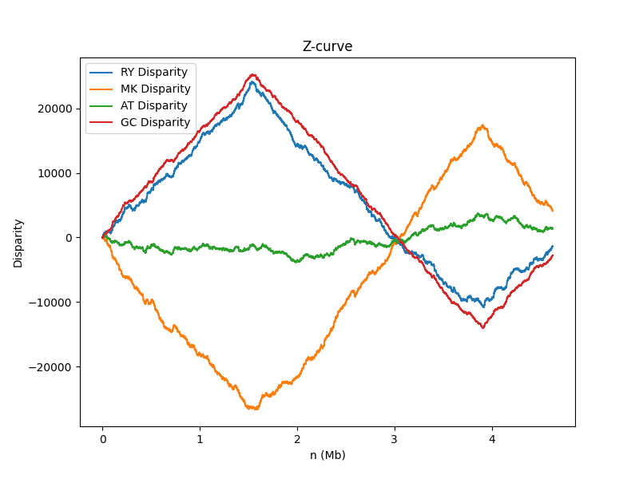
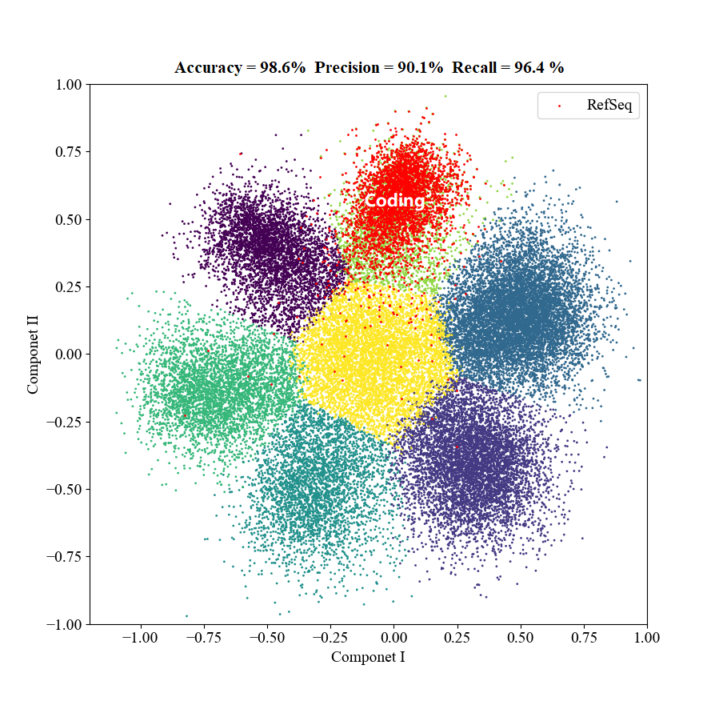

# Python API
We listed a table here corresponding to that in the **Introduction** to better help readers sort out the logical relationship between the various curve-related APIs:  
|Cumulative Curve     |Profile Curve       |Segmentation Method |Order Index S(P)*  |
|:--------------------|:-------------------|:-------------------|:------------------|
|z_curve              |**\*\***            |genome_dS_curve     |genome_order_index |
|RY_disparity         |x_prime_curve       |RY_dS_curve         |RY_order_index     |
|MK_disparity         |y_prime_curve       |MK_dS_curve         |MK_order_index     |
|WS_disparity         |z_prime_curve       |WS_dS_curve         |WS_order_index     |
|AT_disparity         |AT_prime_curve      |AT_dS_curve         |AT_order_index     |
|GC_disparity         |GC_prime_curve      |GC_dS_curve         |GC_order_index     |
|**\*\*\***           |CpG_prime_curve     |CpG_dS_curve        |CpG_order_index    |

**\*** &nbsp;&nbsp;&nbsp; The order index was treated as a feature of the sequence for machine learning in earlier studies, so it is integrated under the ZCurveEncoder. The other APIs are integrated under ZCurvePlotter.  
**\*\*** &nbsp;&nbsp;&nbsp;Z profile curves in 3D form are generally not used for visualization, but their parameters are used for gene starting point prediction, so we only provide it in "profile" mode of BatchZCurvePlotter to batch the dataset. You can use bulk interfaces (x_prime_curve, y_prime_curve, z_prime_curve) to implement it in 3D form as well.  
**\*\*\*** &nbsp;The geometry of the CpG-disparity curve is not obvious, so we do not provide a standard API. Readers may implement and explore its features on their own.

## ZCurvePy
This is the Python package `__init__` module of released ZCurvePy package. All the C/C++ apis can be called through this module. If you don't want to import additional third-party modules (e.g. modules from scikit-learn) or APIs written in pure Python provided by ZCurvePy (e.g. [ZCurveBuilder](#ZCurveBuilder)), use `import _ZCurvePy` instead of `import ZCurvePy`.

### ZCurvePlotter
A simple API for plotting a nucleotide sequence to Z-curve or do segmentation based on order index. Multi-thread is not supported by this API. If you want to plot Z-curve for a large dataset using multi-thread, use [BatchZCurvePlotter](#batchzcurveplotter) instead. This API only returns coordinate information and provides no graphical operations. If you want visual curves, use commandline tools or program it by yourself using visualization library like [Matplotlib](https://matplotlib.org/) and [Plotly](https://plotly.com/python/).

#### `ZCurvePlotter.__init__`
`__init__` method  of _ZCurvePy.ZCurvePlotter  
**Args:**  
- seq_or_record:   
Object that stores information of nucleic sequence. str, Bio.Seq.Seq, Bio.SeqRecord.SeqRecord and many other types are supported.

**Returns:**
- plotter (object):  
  _ZCurvePy.ZCurvePlotter

#### `ZCurvePlotter.z_curve`
Convert a DNA sequence or RNA sequence to Z-curve.  

**Background**  
Z-curve theory is a geometrical approach to genome analysis. The Z-curve is a three-dimensional curve that represents a DNA sequence in the sense that each can be uniquely reconstructed
given the other.The Z-curve, therefore, contains all the information that the corresponding DNA sequence carries.

**Definition**  
Let $A_n$, $G_n$, $C_n$ and $T_n$ be the count of A, G, C and T of a subsequence consisting of the first n nucleotides of a DNA, s.t.

$x_n = (A_n + G_n) - (C_n + T_n)$  
$y_n = (A_n + C_n) - (G_n + T_n), n=1,2,3 ...,N$  
$z_n = (A_n + T_n) - (G_n + C_n)$  

The $x_n$, $y_n$, $z_n$ can be drawn in a three-dimensional rectangular coordinate system, or take the length of the sequence as the horizontal axis and be drawn in three plane coordinate systems.
In this process, both global and local features of the sequence are well visualized.

This curve could be smoothed using mean-smoothing method.

**Application Scene**  
Genome visualization; Replication origins prediction; Machine learning  

**Usage Example**
```python
from Bio import SeqIO
from ZCurvePy import ZCurvePlotter
import matplotlib.pyplot as plt

record = SeqIO.read("e_coli.fa", "fasta")
plotter = ZCurvePlotter(record)
x, y, z = plotter.z_curve(window=10000, return_n=False)
# n, x, y, z = plotter.z_curve(window=10000)

fig = plt.figure(figsize=(10, 10))
ax3d = fig.add_subplot(projection='3d')
ax3d.plot(x, y, z)
ax3d.set_xlabel("X", labelpad=10)
ax3d.set_ylabel("Y", labelpad=10)
ax3d.set_zlabel("Z", labelpad=10)
plt.show()
```
**Args:**  
  - window (int):  
  Window size used by mean-smoothing method. If a value <= 0 is given, do nothing and return the original curve data. (Default: 0)
  - return_n (bool):  
  Return the sequence length axis or not. (Default: True)

**Returns:**  
  - n (list):  
  The sequence length axis.
  - x (list):  
  The x values of the Z-curve.
  - y (list):  
  The y values of the Z-curve.
  - z (list):  
  The z values of the Z-curve


#### `ZCurvePlotter.RY_disparity`
Returns the x values of the Z-curve (RY-disparity).

**Definition**  
Let $A_n$, $G_n$, $C_n$ and $T_n$ be the count of A, G, C and T of a subsequence consisting of the first n nucleotides of a DNA, s.t.

$x_n = (A_n + G_n) - (C_n + T_n), n=1,2,3 ...,N$  

This curve could be smoothed using mean-smoothing method.

**Application Scene**  
Genome visualization; Replication origins prediction; Machine learning

**Usage Example**
```python
from Bio import SeqIO
from ZCurvePy import ZCurvePlotter
import matplotlib.pyplot as plt

record = SeqIO.read("e_coli.fa", "fasta")
plotter = ZCurvePlotter(record)
n, x = plotter.RY_disparity(window=100)
# x = plotter.RY_disparity(window=100, return_n=False)
plt.plot(n, x)
plt.xlabel('n (bp)', labelpad=10)
plt.ylabel('RY Disparity', labelpad=10)
plt.show()
```
**Args:**  
  - window (int):  
  Window size used by mean-smoothing method. If a value <= 0 is given, do nothing and return the original curve data. (Default: 0)
  - return_n (bool):  
  Return the sequence length axis or not. (Default: True)

**Returns:**  
  - n (list):  
  The sequence length axis.
  - x (list):  
  The x values of the Z-curve.


#### `ZCurvePlotter.MK_disparity`
Returns the y values of the Z-curve (MK-disparity).

**Definition**  
Let $A_n$, $G_n$, $C_n$ and $T_n$ be the count of A, G, C and T of a subsequence consisting of the first n nucleotides of a DNA, s.t.

$y_n = (A_n + C_n) - (G_n + T_n), n=1,2,3 ...,N$  

This curve could be smoothed using mean-smoothing method.

**Application Scene**  
Genome visualization; Replication origins prediction; Machine learning

**Usage Example**
```python
from Bio import SeqIO
from ZCurvePy import ZCurvePlotter
import matplotlib.pyplot as plt

record = SeqIO.read("e_coli.fa", "fasta")
plotter = ZCurvePlotter(record)
n, y = plotter.MK_disparity(window=100)
# y = plotter.MK_disparity(window=100, return_n=False)
plt.plot(n, y)
plt.xlabel('n (bp)', labelpad=10)
plt.ylabel('MK Disparity', labelpad=10)
plt.show()
```
*For the visual displaying example, please see ZCurvePlotter.RY_disparity*  
**Args:**  
  - window (int):  
  Window size used by mean-smoothing method. If a value <= 0 is given, do nothing and return the original curve data. (Default: 0)
  - return_n (bool):  
  Return the sequence length axis or not. (Default: True)

**Returns:**  
  - n (list):  
  The sequence length axis.
  - y (list):  
  The y values axis of the Z-curve.

#### `ZCurvePlotter.WS_disparity`
Returns the z values of the Z-curve (WS-disparity).

**Definition**  
Let $A_n$, $G_n$, $C_n$ and $T_n$ be the count of A, G, C and T of a subsequence consisting of the first n nucleotides of a DNA, s.t.

$z_n = (A_n + T_n) - (G_n + C_n), n=1,2,3 ...,N$  

This curve could be smoothed using mean-smoothing method.

**Application Scene**  
Genome visualization; Replication origins prediction; Machine learning

**Usage Example**
```python
from Bio import SeqIO
from ZCurvePy import ZCurvePlotter
import matplotlib.pyplot as plt

record = SeqIO.read("e_coli.fa", "fasta")
plotter = ZCurvePlotter(record)
n, z = plotter.WS_disparity(window=100)
# z = plotter.WS_disparity(window=100, return_n=False)
plt.plot(n, z)
plt.xlabel('n (bp)', labelpad=10)
plt.ylabel('WS Disparity', labelpad=10)
plt.show()
```
*The local geometry of WS-display is not significant in the vast majority of species. (due to stable GC content)*  
**Args:**  
  - window (int):  
  Window size used by mean-smoothing method. If a value <= 0 is given, do nothing and return the original curve data. (Default: 0)
  - return_n (bool):  
  Return the sequence length axis or not. (Default: True)

**Returns:**  
  - n (list):  
  The sequence length axis.
  - z (list):  
  The z values axis of the Z-curve.

#### `ZCurvePlotter.AT_disparity`
Returns AT-disparity (equivalent to AT-skew in some cases).

**Definition**  
Let $A_n$ and $T_n$ be the count of A and T of a subsequence consisting of the first n nucleotides of a DNA, s.t.

$d_{\rm AT}(n) = A_n - T_n, n=1,2,3 ...,N$  

This curve could be smoothed using mean-smoothing method.

**Application Scene**  
Genome visualization

**Usage Example**
```python
from Bio import SeqIO
from ZCurvePy import ZCurvePlotter
import matplotlib.pyplot as plt

record = SeqIO.read("e_coli.fa", "fasta")
plotter = ZCurvePlotter(record)
n, d = plotter.AT_disparity(window=100)
# d = plotter.AT_disparity(window=100, return_n=False)
plt.plot(n, d)
plt.xlabel('n (bp)', labelpad=10)
plt.ylabel('AT Disparity', labelpad=10)
plt.show()
```
*For the visual displaying example, please see ZCurvePlotter.RY_disparity*  
**Args:**  
  - window (int):  
  Window size used by mean-smoothing method. If a value <= 0 is given, do nothing and return the original curve data. (Default: 0)
  - return_n (bool):  
  Return the sequence length axis or not. (Default: True)

**Returns:**  
  - n (list):  
  The sequence length axis.
  - d (list):  
  The AT-disparity values.

#### `ZCurvePlotter.GC_disparity`

Returns GC-disparity (equivalent to GC-skew in some cases).

**Definition**  
Let $G_n$ and $C_n$ be the count of A and T of a subsequence consisting of the first n nucleotides of a DNA, s.t.

$d_{\rm GC}(n) = G_n - C_n, n=1,2,3 ...,N$  

This curve could be smoothed using mean-smoothing method.

**Application Scene**  
Genome visualization

**Usage Example**
```python
from Bio import SeqIO
from ZCurvePy import ZCurvePlotter
import matplotlib.pyplot as plt

record = SeqIO.read("e_coli.fa", "fasta")
plotter = ZCurvePlotter(record)
n, f = plotter.GC_disparity(window=100)
# f = plotter.GC_disparity(window=100, return_n=False)
plt.plot(n, f)
plt.xlabel('n (bp)', labelpad=10)
plt.ylabel('GC Disparity', labelpad=10)
plt.show()
```
*For the visual displaying example, please see ZCurvePlotter.RY_disparity*  
**Args:**  
  - window (int):  
  Window size used by mean-smoothing method. If a value <= 0 is given, do nothing and return the original curve data. (Default: 0)
  - return_n (bool):  
  Return the sequence length axis or not. (Default: True)

**Returns:**  
  - n (list):  
  The sequence length axis.
  - f (list):  
  The GC-disparity values.

#### `ZCurvePlotter.x_prime_curve`

Calculate x' values and the slope 'k'.

**Background**  
The different patterns of the species-specific, conserved nucleotide distribution are helpful to extract some recognition variables to identify gene starts. In prokaryotic genomes, a major jump in xn occurs in the region of −14 to −7 for the true start codons, but not for the non-coding ORFs. It is likely caused by purine-rich SD sequence.Therefore the features of mononucleotide frequencies near the true start codons are notably different from those of the upstream and downstream false starts.

**Definition**  
Let $A_n$, $G_n$, $C_n$ and $T_n$ be the count of A, G, C and T of a subsequence consisting of the first n nucleotides of a DNA, s.t.

$x_n = (A_n + G_n) - (C_n + T_n), n=1,2,3 ...,N$

apply a linear fit to the curve based on least square method, then a slope 'k' is obtained, s.t.

$x'_n = x_n - kn, n=1,2,3 ...,N$

**Application Scene**  
Genome visualization; Gene start sites prediction

**Usage Example**
```python
from Bio import SeqIO
from ZCurvePy import ZCurvePlotter
import matplotlib.pyplot as plt

record = SeqIO.read("e_coli.fa", "fasta")
plotter = ZCurvePlotter(record)
n, xp, k = plotter.x_prime_curve(window=100)
# xp, k = plotter.x_prime_curve(window=100, return_n=False)
plt.plot(n, xp)
plt.xlabel('n (bp)', labelpad=10)
plt.ylabel("x'", labelpad=10)
plt.show()
```

**Args:**  
- window (int):  
  Window size used by mean-smoothing method. If a value <= 0 is given, do nothing and return the original curve data. (Default: 0)
- return_n (bool):  
  return the sequence length axis or not. (Default: True)  

**Returns:**  
- n (list):  
  The sequence length axis.
- xp (list):  
  The x' values.
- k (float):  
  The slope value 'k'.

  
#### `ZCurvePlotter.y_prime_curve`

Calculate y' values and the slope 'k'.

**Definition**  
Let $A_n$, $G_n$, $C_n$ and $T_n$ be the count of A, G, C and T of a subsequence consisting of the first n nucleotides of a DNA, s.t.

$y_n = (A_n + C_n) - (G_n + T_n), n=1,2,3 ...,N$

apply a linear fit to the curve based on least square method, then a slope 'k' is obtained, s.t.

$y'_n = y_n - kn, n=1,2,3 ...,N$

**Application Scene**  
Genome visualization; Gene start sites prediction

**Usage Example**
```python
from Bio import SeqIO
from ZCurvePy import ZCurvePlotter
import matplotlib.pyplot as plt

record = SeqIO.read("e_coli.fa", "fasta")
plotter = ZCurvePlotter(record)
n, yp, k = plotter.y_prime_curve(window=100)
# yp, k = plotter.y_prime_curve(window=100, return_n=False)
plt.plot(n, yp)
plt.xlabel('n (bp)', labelpad=10)
plt.ylabel("y'", labelpad=10)
plt.show()
```
*For the visual displaying example, please see ZCurvePlotter.x_prime_curve*  

**Args:**  
- window (int):  
  Window size used by mean-smoothing method. If a value <= 0 is given, do nothing and return the original curve data. (Default: 0)
- return_n (bool):  
  return the sequence length axis or not. (Default: True)  

**Returns:**  
- n (list):  
  The sequence length axis.
- yp (list):  
  The y' values.
- k (float):  
  The slope value 'k'.

#### `ZCurvePlotter.z_prime_curve`

Calculate z' values and the slope 'k'.

**Background**  
The GC profile is a windowless technique to calculate the G+C content of genomic DNA sequences as well as visualize isolate structures, which is rich of G+C. By this method, the G content can be calculated at different 'resolution'.In an extreme case, the G content may be computed at a specific point, rather than in a window of finite size. This is particularly useful to analyze the fine variation of base composition along genomic sequences.

**Definition**  
Let $A_n$, $G_n$, $C_n$ and $T_n$ be the count of A, G, C and T of a subsequence consisting of the first n nucleotides of a DNA, s.t.

$z_n = (A_n + T_n) - (G_n + C_n), n=1,2,3 ...,N$

apply a linear fit to the curve based on least square method, then a slope 'k' is obtained, s.t.

$z'_n = z_n - kn, n=1,2,3 ...,N$

**Application Scene**  
Genome visualization; Gene start sites prediction

**Usage Example**
```python
from Bio import SeqIO
from ZCurvePy import ZCurvePlotter
import matplotlib.pyplot as plt

record = SeqIO.read("e_coli.fa", "fasta")
plotter = ZCurvePlotter(record)
n, zp, k = plotter.z_prime_curve(window=100)
# zp, k = plotter.z_prime_curve(window=100, return_n=False)
plt.plot(n, zp)
plt.xlabel('n (bp)', labelpad=10)
plt.ylabel("z'", labelpad=10)
plt.show()
```

**Args:**  
- window (int):  
  Window size used by mean-smoothing method. If a value <= 0 is given, do nothing and return the original curve data. (Default: 0)
- return_n (bool):  
  return the sequence length axis or not. (Default: True)  

**Returns:**  
- n (list):  
  The sequence length axis.
- zp (list):  
  The z' values.
- k (float):  
  The slope value 'k'.  


#### `ZCurvePlotter.AT_prime_curve`

Calculate d'AT values for AT-disparity.

**Definition**  
Let $A_n$ and $T_n$ be the count of A and T of a subsequence consisting of the first n nucleotides of a DNA, s.t.

$d_{\rm AT}(n) = A_n - T_n, n=1,2,3 ...,N$

apply a linear fit to the curve based on least square method, then a slope 'k' is obtained, s.t.

$d'_{\rm AT}(n) = d_{\rm AT}(n) - kn, n=1,2,3 ...,N$

**Application Scene**  
Genome visualization

**Usage Example**
```python
from Bio import SeqIO
from ZCurvePy import ZCurvePlotter
import matplotlib.pyplot as plt

record = SeqIO.read("e_coli.fa", "fasta")
plotter = ZCurvePlotter(record)
n, dp, k = plotter.AT_prime_curve(window=100)
# dp, k = plotter.AT_prime_curve(window=100, return_n=False)
plt.plot(n, dp)
plt.xlabel('n (bp)', labelpad=10)
plt.ylabel("d'AT", labelpad=10)
plt.show()
```
*For the visual displaying example, please see ZCurvePlotter.x_prime_curve*  

**Args:**  
- window (int):  
  Window size used by mean-smoothing method. If a value <= 0 is given, do nothing and return the original curve data. (Default: 0)
- return_n (bool):  
  return the sequence length axis or not. (Default: True)  

**Returns:**  
- n (list):  
  The sequence length axis.
- dp (list):  
  The d'AT values.
- k (float):  
  The slope value 'k'.

#### `ZCurvePlotter.GC_prime_curve`

Calculate d'GC values for GC-disparity.

**Definition**  
Let $G_n$ and $C_n$ be the count of G and C of a subsequence consisting of the first n nucleotides of a DNA, s.t.

$d_{\rm GC}(n) = G_n - C_n, n=1,2,3 ...,N$

apply a linear fit to the curve based on least square method, then a slope 'k' is obtained, s.t.

$d'_{\rm GC}(n) = d_{\rm GC}(n) - kn, n=1,2,3 ...,N$

**Application Scene**  
Genome visualization

**Usage Example**
```python
from Bio import SeqIO
from ZCurvePy import ZCurvePlotter
import matplotlib.pyplot as plt

record = SeqIO.read("e_coli.fa", "fasta")
plotter = ZCurvePlotter(record)
n, fp, k = plotter.GC_prime_curve(window=100)
# fp, k = plotter.GC_prime_curve(window=100, return_n=False)
plt.plot(n, fp)
plt.xlabel('n (bp)', labelpad=10)
plt.ylabel("d'GC", labelpad=10)
plt.show()
```
*For the visual displaying example, please see ZCurvePlotter.x_prime_curve*  

**Args:**  
- window (int):  
  Window size used by mean-smoothing method. If a value <= 0 is given, do nothing and return the original curve data. (Default: 0)
- return_n (bool):  
  return the sequence length axis or not. (Default: True)  

**Returns:**  
- n (list):  
  The sequence length axis.
- fp (list):  
  The d'GC values.
- k (float):  
  The slope value 'k'.

#### `ZCurvePlotter.CpG_prime_curve`

Calculate z' values for CpG-profile.

**Definition**  
Let $CpG_n$ be the count of CpG dinucleotide units in a DNA sequence, s.t.

$z_n = 2CpG_n - n, n=1,2,3 ...,N$

apply a linear fit to the curve based on least square method, then a slope 'k' is obtained, s.t.

$z'_n = z_n - kn, n=1,2,3 ...,N$

**Application Scene**  
Genome visualization

**Usage Example**
```python
from Bio import SeqIO
from ZCurvePy import ZCurvePlotter
import matplotlib.pyplot as plt

record = SeqIO.read("e_coli.fa", "fasta")
plotter = ZCurvePlotter(record)
n, zp, k = plotter.CpG_prime_curve(window=100)
# zp, k = plotter.CpG_prime_curve(window=100, return_n=False)
plt.plot(n, zp)
plt.xlabel('n (bp)', labelpad=10)
plt.ylabel("CpG-profile", labelpad=10)
plt.show()
```  
*For the visual displaying example, please see ZCurvePlotter.z_prime_curve*  
**Args:**  
- window (int):  
  Window size used by mean-smoothing method. If a value <= 0 is given, do nothing and return the original curve data. (Default: 0)
- return_n (bool):  
  return the sequence length axis or not. (Default: True)  

**Returns:**  
- n (list):  
  The sequence length axis.
- zp (list):  
  The CpG-profile values.
- k (float):  
  The slope value 'k'.  


#### `ZCurvePlotter.genome_dS_curve`
Return dS(P) curve and its max point and max value. Segmentation algorithm for DNA sequences.  

**Background**  
Based on the quadratic divergence,the segmentation algorithm to partition a given genome or DNA sequence into compositionally distinct domains is put forward. The algorithm has been applied to segment human chromosome sequences, and the boundaries of isochores for each chromosome were obtained. Compared with the results obtained by using the entropic segmentation algorithm based on the Jensen-Shannon divergence, both algorithms resulted in all identical coordinates of segmentation points. An explanation of the equivalence of the two segmentation algorithms is presented. The new algorithm has a number of advantages. Particularly, it is much simpler and faster than the entropy-based method. Therefore, the new algorithm is more suitable for analyzing long genome sequences, such as human and other newly sequenced eukaryotic genome sequences.

**Definition**  
Let $a_n$, $g_n$, $c_n$ and $t_n$ be the frequency of A, G, C, T of a subsequence consisting of the first n nucleotides of a DNA, such that  

$S_n({\rm P}) = a_n^2 + t_n^2 + c_n^2 + g_n^2, n=1,2,3...,N$

and denote that of the rest of the sequence by $S({\rm Q})$, such that we have

$dS_n({\rm P}) = S_n({\rm P}) + S_n({\rm Q}) - S({\rm P + Q}), n=1,2,3...,N$

the max point of the $dS_n({\rm P})$ is the segment point in a round of the recursive algorithm.

$n_{\rm seg} = {\rm argmax}\{dS_n({\rm P})\}$

**Application Scene**  
Genome segmentation

**Usage Example**
```python
from Bio import SeqIO
from ZCurvePy import ZCurvePlotter
import matplotlib.pyplot as plt

record = SeqIO.read("e_coli.fa", "fasta")
plotter = ZCurvePlotter(record)
n, sp, mp, mv = plotter.genome_dS_curve(window=10)
# sp, mp, mv = plotter.genome_dS_curve(return_n=False)
# mp, mv = plotter.genome_dS_curve(only_m=True)
plt.plot(n, sp)
plt.axvline(n, mp)
plt.xlabel('n (bp)', labelpad=10)
plt.ylabel("dS(P)", labelpad=10)
plt.show()
```

**Args:**  
- window (int):  
  Window size used by mean-smoothing method. If a value <= 0 is given, do nothing and return the original curve data. (Default: 0)
- return_n (bool):  
  return the sequence length axis or not. (Default: True)  
- only_m (bool):  
  only return max point and max value.

**Returns:**  
- n (list):  
  The sequence length axis.
- sp (list):  
  The S(P) values axis.
- mp (float):  
  The max point of S(P).
- mv (float):  
  The max value of S(P).  


#### `ZCurvePlotter.RY_dS_curve`
Return dS(P) curve for RY disparity and its max point and max value. Segmentation algorithm for DNA sequences.

**Definition**  
Let $a_n$, $g_n$, $c_n$ and $t_n$ be the frequency of A, G, C, T of a subsequence consisting of the first n nucleotides of a DNA, such that  

$S_n({\rm P}) = (a_n + g_n)^2 + (c_n + t_n)^2, n=1,2,3...,N$

and denote that of the rest of the sequence by $S({\rm Q})$, such that we have

$dS_n({\rm P}) = S_n({\rm P}) + S_n({\rm Q}) - S({\rm P + Q}), n=1,2,3...,N$

the max point of the $dS_n({\rm P})$ is the segment point in a round of the recursive algorithm.

$n_{\rm seg} = {\rm argmax}\{dS_n({\rm P})\}$

**Application Scene**  
Genome segmentation

**Usage Example**
```python
from Bio import SeqIO
from ZCurvePy import ZCurvePlotter
import matplotlib.pyplot as plt

record = SeqIO.read("e_coli.fa", "fasta")
plotter = ZCurvePlotter(record)
n, sp, mp, mv = plotter.RY_dS_curve(window=10)
# sp, mp, mv = plotter.RY_dS_curve(return_n=False)
# mp, mv = plotter.RY_dS_curve(only_m=True)
plt.plot(n, sp)
plt.axvline(n, mp)
plt.xlabel('n (bp)', labelpad=10)
plt.ylabel("dS(P)", labelpad=10)
plt.show()
```

**Args:**  
- window (int):  
  Window size used by mean-smoothing method. If a value <= 0 is given, do nothing and return the original curve data. (Default: 0)
- return_n (bool):  
  return the sequence length axis or not. (Default: True)  
- only_m (bool):  
  only return max point and max value.

**Returns:**  
- n (list):  
  The sequence length axis.
- sp (list):  
  The S(P) values axis.
- mp (float):  
  The max point of S(P).
- mv (float):  
  The max value of S(P).


#### `ZCurvePlotter.MK_dS_curve`
Return dS(P) curve for MK disparity and its max point and max value. Segmentation algorithm for DNA sequences.

**Definition**  
Let $a_n$, $g_n$, $c_n$ and $t_n$ be the frequency of A, G, C, T of a subsequence consisting of the first n nucleotides of a DNA, such that  

$S_n({\rm P}) = (a_n + c_n)^2 + (g_n + t_n)^2, n=1,2,3...,N$

and denote that of the rest of the sequence by $S({\rm Q})$, such that we have

$dS_n({\rm P}) = S_n({\rm P}) + S_n({\rm Q}) - S({\rm P + Q}), n=1,2,3...,N$

the max point of the $dS_n({\rm P})$ is the segment point in a round of the recursive algorithm.

$n_{\rm seg} = {\rm argmax}\{dS_n({\rm P})\}$

**Application Scene**  
Genome segmentation

**Usage Example**
```python
from Bio import SeqIO
from ZCurvePy import ZCurvePlotter
import matplotlib.pyplot as plt

record = SeqIO.read("e_coli.fa", "fasta")
plotter = ZCurvePlotter(record)
n, sp, mp, mv = plotter.MK_dS_curve(window=10)
# sp, mp, mv = plotter.MK_dS_curve(return_n=False)
# mp, mv = plotter.MK_dS_curve(only_m=True)
plt.plot(n, sp)
plt.axvline(n, mp)
plt.xlabel('n (bp)', labelpad=10)
plt.ylabel("dS(P)", labelpad=10)
plt.show()
```  
*The segmented pattern of bacteria MK disparity is the same as Z-curve, see ZCurvePlotter.genome_order_index*  
**Args:**  
- window (int):  
  Window size used by mean-smoothing method. If a value <= 0 is given, do nothing and return the original curve data. (Default: 0)
- return_n (bool):  
  return the sequence length axis or not. (Default: True)  
- only_m (bool):  
  only return max point and max value.

**Returns:**  
- n (list):  
  The sequence length axis.
- sp (list):  
  The S(P) values axis.
- mp (float):  
  The max point of S(P).
- mv (float):  
  The max value of S(P).

#### `ZCurvePlotter.WS_dS_curve`
Return dS(P) curve for WS disparity and its max point and max value. Segmentation algorithm for DNA sequences.

**Definition**  
Let $a_n$, $g_n$, $c_n$ and $t_n$ be the frequency of A, G, C, T of a subsequence consisting of the first n nucleotides of a DNA, such that  

$S_n({\rm P}) = (a_n + t_n)^2 + (c_n + g_n)^2, n=1,2,3...,N$

and denote that of the rest of the sequence by $S({\rm Q})$, such that we have

$dS_n({\rm P}) = S_n({\rm P}) + S_n({\rm Q}) - S({\rm P + Q}), n=1,2,3...,N$

the max point of the $dS_n({\rm P})$ is the segment point in a round of the recursive algorithm.

$n_{\rm seg} = {\rm argmax}\{dS_n({\rm P})\}$

**Application Scene**  
Genome segmentation

**Usage Example**
```python
from Bio import SeqIO
from ZCurvePy import ZCurvePlotter
import matplotlib.pyplot as plt

record = SeqIO.read("e_coli.fa", "fasta")
plotter = ZCurvePlotter(record)
n, sp, mp, mv = plotter.WS_dS_curve(window=10)
# sp, mp, mv = plotter.WS_dS_curve(return_n=False)
# mp, mv = plotter.WS_dS_curve(only_m=True)
plt.plot(n, sp)
plt.axvline(n, mp)
plt.xlabel('n (bp)', labelpad=10)
plt.ylabel("dS(P)", labelpad=10)
plt.show()
```

**Args:**  
- window (int):  
  Window size used by mean-smoothing method. If a value <= 0 is given, do nothing and return the original curve data. (Default: 0)
- return_n (bool):  
  return the sequence length axis or not. (Default: True)  
- only_m (bool):  
  only return max point and max value.

**Returns:**  
- n (list):  
  The sequence length axis.
- sp (list):  
  The S(P) values axis.
- mp (float):  
  The max point of S(P).
- mv (float):  
  The max value of S(P).

#### `ZCurvePlotter.AT_dS_curve`
Return dS(P) curve for AT disparity and its max point and max value. Segmentation algorithm for DNA sequences.

**Definition**  
Let $a_n$, $g_n$, $c_n$ and $t_n$ be the frequency of A, G, C, T of a subsequence consisting of the first n nucleotides of a DNA, such that  

$S_n({\rm P}) = a_n^2 + t_n^2, n=1,2,3...,N$

and denote that of the rest of the sequence by $S({\rm Q})$, such that we have

$dS_n({\rm P}) = S_n({\rm P}) + S_n({\rm Q}) - S({\rm P + Q}), n=1,2,3...,N$

the max point of the $dS_n({\rm P})$ is the segment point in a round of the recursive algorithm.

$n_{\rm seg} = {\rm argmax}\{dS_n({\rm P})\}$

**Application Scene**  
Genome segmentation

**Usage Example**
```python
from Bio import SeqIO
from ZCurvePy import ZCurvePlotter
import matplotlib.pyplot as plt

record = SeqIO.read("e_coli.fa", "fasta")
plotter = ZCurvePlotter(record)
n, sp, mp, mv = plotter.AT_dS_curve(window=10)
# sp, mp, mv = plotter.AT_dS_curve(return_n=False)
# mp, mv = plotter.AT_dS_curve(only_m=True)
plt.plot(n, sp)
plt.axvline(n, mp)
plt.xlabel('n (bp)', labelpad=10)
plt.ylabel("dS(P)", labelpad=10)
plt.show()
```  
*The geometric characteristics of the curves AT disparity are not significant.*  
**Args:**  
- window (int):  
  Window size used by mean-smoothing method. If a value <= 0 is given, do nothing and return the original curve data. (Default: 0)
- return_n (bool):  
  return the sequence length axis or not. (Default: True)  
- only_m (bool):  
  only return max point and max value.

**Returns:**  
- n (list):  
  The sequence length axis.
- sp (list):  
  The S(P) values axis.
- mp (float):  
  The max point of S(P).
- mv (float):  
  The max value of S(P).

#### `ZCurvePlotter.GC_dS_curve`
Return dS(P) curve for GC disparity and its max point and max value. Segmentation algorithm for DNA sequences.

**Definition**  
Let $a_n$, $g_n$, $c_n$ and $t_n$ be the frequency of A, G, C, T of a subsequence consisting of the first n nucleotides of a DNA, such that  

$S_n({\rm P}) = g_n^2 + c_n^2, n=1,2,3...,N$

and denote that of the rest of the sequence by $S({\rm Q})$, such that we have

$dS_n({\rm P}) = S_n({\rm P}) + S_n({\rm Q}) - S({\rm P + Q}), n=1,2,3...,N$

the max point of the $dS_n({\rm P})$ is the segment point in a round of the recursive algorithm.

$n_{\rm seg} = {\rm argmax}\{dS_n({\rm P})\}$

**Application Scene**  
Genome segmentation

**Usage Example**
```python
from Bio import SeqIO
from ZCurvePy import ZCurvePlotter
import matplotlib.pyplot as plt

record = SeqIO.read("e_coli.fa", "fasta")
plotter = ZCurvePlotter(record)
n, sp, mp, mv = plotter.GC_dS_curve(window=10)
# sp, mp, mv = plotter.GC_dS_curve(return_n=False)
# mp, mv = plotter.GC_dS_curve(only_m=True)
plt.plot(n, sp)
plt.axvline(n, mp)
plt.xlabel('n (bp)', labelpad=10)
plt.ylabel("dS(P)", labelpad=10)
plt.show()
```
*The segmented pattern of bacteria GC disparity is the same as RY disparity, see ZCurvePlotter.RY_dS_curve*  
**Args:**  
- window (int):  
  Window size used by mean-smoothing method. If a value <= 0 is given, do nothing and return the original curve data. (Default: 0)
- return_n (bool):  
  return the sequence length axis or not. (Default: True)  
- only_m (bool):  
  only return max point and max value.

**Returns:**  
- n (list):  
  The sequence length axis.
- sp (list):  
  The S(P) values axis.
- mp (float):  
  The max point of S(P).
- mv (float):  
  The max value of S(P).

#### `ZCurvePlotter.CpG_dS_curve`
Return dS(P) curve for CpG-profile and its max point and max value. Segmentation algorithm for DNA sequences.

**Definition**  
Let $p_n({\rm CpG})$ be the frequency of CpG dinucleotide units in a DNA sequence, such that the CpG order index could be defined as:

$S_n({\rm P}) = [p_n({\rm CpG})]^2 + [1 - p_n({\rm CpG})]^2, n=1,2,3...,N$

and denote that of the rest of the sequence by $S({\rm Q})$, such that we have

$dS_n({\rm P}) = S_n({\rm P}) + S_n({\rm Q}) - S({\rm P + Q}), n=1,2,3...,N$

the max point of the $dS_n({\rm P})$ is the segment point in a round of the recursive algorithm.

$n_{\rm seg} = {\rm argmax}\{dS_n({\rm P})\}$

**Application Scene**  
Genome segmentation

**Usage Example**
```python
from Bio import SeqIO
from ZCurvePy import ZCurvePlotter
import matplotlib.pyplot as plt

record = SeqIO.read("e_coli.fa", "fasta")
plotter = ZCurvePlotter(record)
n, sp, mp, mv = plotter.CpG_dS_curve(window=10)
# sp, mp, mv = plotter.CpG_dS_curve(return_n=False)
# mp, mv = plotter.CpG_dS_curve(only_m=True)
plt.plot(n, sp)
plt.axvline(n, mp)
plt.xlabel('n (bp)', labelpad=10)
plt.ylabel("dS(P)", labelpad=10)
plt.show()
```
*For visual presentation of segmented points, see ZCurvePlotter.CpG_prime_curve*  
**Args:**  
- window (int):  
  Window size used by mean-smoothing method. If a value <= 0 is given, do nothing and return the original curve data. (Default: 0)
- return_n (bool):  
  return the sequence length axis or not. (Default: True)  
- only_m (bool):  
  only return max point and max value.

**Returns:**  
- n (list):  
  The sequence length axis.
- sp (list):  
  The S(P) values axis.
- mp (float):  
  The max point of S(P).
- mv (float):  
  The max value of S(P).

### ZCurveEncoder  
A simple API for converting a DNA sequence to Z-curve parameters, generally used in teaching or learning settings. Multi-thread is not supported by this API. If you want to use multi-thread, please use ZCurvePy.BatchZCurveCoder instead.

#### `ZCurveEncoder.__init__`  
`__init__` module of  ZCurvePy.ZCurveEncoder  

**Args:**  
- seq_or_record:  
  object that stores information of nucleic sequence. str, Bio.Seq, Bio.SeqRecord and many other types are supported.  

**Returns:**  
- object:  
  _ZCurvePy.ZCurveEncoder  

#### `ZCurveEncoder.mononucl_transform`  
Do non-phase mononucleotide transformation on a DNA sequence. Generate 3 parameters.  

**Definition**  
Let $A_n$, $G_n$, $C_n$, $T_n$ be the counts of A, G, C, T in a DNA sequence of length $n$, such that the mononucleotide Z-curve transformation can be:

$X_n = (A_n + G_n) - (C_n + T_n)$  
$Y_n = (A_n + C_n) - (G_n + T_n)$  
$Z_n = (A_n + T_n) - (C_n + G_n)$  

It could also be defined using frequency of bases, which means a kind of normalized version, like:

$x = [(A_n + G_n) - (C_n + T_n)] / n$  
$y = [(A_n + C_n) - (G_n + T_n)] / n$  
$z = [(A_n + T_n) - (C_n + G_n)] / n$  

For more information, please see: *ZCurvePy.ZCurveEncoder.k_nucl_phase_transform*

**Usage Example**
```python
from Bio import SeqIO
record = SeqIO.read("example.fa", "fasta")
encoder = ZCurveEncoder(record)
params = encoder.mononucl_transform()
# params = encoder.mononucl_transform(freq=True)
```

**Application Scene**  
Gene recognition; Machine learning; Deep learning

**Args:**
- freq (bool):  
  do frequencization or not (default: False)
- local (bool):  
  use local mode to do frequencization

**Returns:**
- list:  
  Z-curve parameters

#### `ZCurveEncoder.dinucl_transform`  
Do non-phase dinucleotide transformation on a DNA sequence. Generate 12 parameters.  

**Definition**  
Let $NA_n$, $NG_n$, $NC_n$, $NT_n$ be the counts of dinucleotides in a DNA sequence of length $n$, such that the dinucleotide Z-curve transformation can be:

$X^{\rm N}_n = (NA_n + NG_n) - (NC_n + NT_n)$  
$Y^{\rm N}_n = (NA_n + NC_n) - (NG_n + NT_n)$  
$Z^{\rm N}_n = (NA_n + NT_n) - (NC_n + NG_n)$ 

It could also be defined using frequency of bases, which means a kind of normalized version, like:

$x^{\rm N}_n = [p_n({\rm NA}) + p_n({\rm NG})] - [p_n({\rm NC}) + p_n({\rm NT})]$  
$y^{\rm N}_n = [p_n({\rm NA}) + p_n({\rm NC})] - [p_n({\rm NG}) + p_n({\rm NT})]$  
$z^{\rm N}_n = [p_n({\rm NA}) + p_n({\rm NT})] - [p_n({\rm NC}) + p_n({\rm NG})]$  

For more information, please see: *ZCurvePy.ZCurveEncoder.k_nucl_phase_transform*

**Usage Example**
```python
from Bio import SeqIO
record = SeqIO.read("example.fa", "fasta")
encoder = ZCurveEncoder(record)
params = encoder.dinucl_transform()
# params = encoder.dinucl_transform(freq=True)
```

**Application Scene**  
Gene recognition; Machine learning; Deep learning

**Args:**
- freq (bool):  
  do frequencization or not (default: False)
- local (bool):  
  use local mode to do frequencization

**Returns:**
- list:  
  Z-curve parameters

#### `ZCurveEncoder.trinucl_transform`  
Do non-phase dinucleotide transformation on a DNA sequence. Generate 48 parameters.  

**Definition**  
Let $XYA_n$, $XYG_n$, $XYC_n$, $XYT_n$ be the counts of trinucleotides in a DNA sequence of length $n$, such that the trinucleotide Z-curve transformation can be:

$X^{\rm XY}_n = (XYA_n + XYG_n) - (XYC_n + XYT_n)$  
$Y^{\rm XY}_n = (XYA_n + XYC_n) - (XYG_n + XYT_n)$  
$Z^{\rm XY}_n = (XYA_n + XYT_n) - (XYC_n + XYG_n)$ 

It could also be defined using frequency of bases, which means a kind of normalized version, like:

$x^{\rm N}_n = [p_n({\rm XYA}) + p_n({\rm XYG})] - [p_n({\rm XYC}) + p_n({\rm XYT})]$  
$y^{\rm N}_n = [p_n({\rm XYA}) + p_n({\rm XYC})] - [p_n({\rm XYG}) + p_n({\rm XYT})]$  
$z^{\rm N}_n = [p_n({\rm XYA}) + p_n({\rm XYT})] - [p_n({\rm XYC}) + p_n({\rm XYG})]$  

For more information, please see: *ZCurvePy.ZCurveEncoder.k_nucl_phase_transform*

**Usage Example**
```python
from Bio import SeqIO
record = SeqIO.read("example.fa", "fasta")
encoder = ZCurveEncoder(record)
params = encoder.trinucl_transform()
# params = encoder.trinucl_transform(freq=True)
```

**Application Scene**  
Gene recognition; Machine learning; Deep learning

**Args:**
- freq (bool):  
  do frequencization or not (default: False)
- local (bool):  
  use local mode to do frequencization

**Returns:**
- list:  
  Z-curve parameters

#### `ZCurveEncoder.mononucl_phase_transform`  
Do phasic mononucleotide transformation on a DNA sequence. Generate 9 parameters.  

**Definition**  
Let $A^i_n$, $G^i_n$, $C^i_n$, $T^i_n$ be the counts of bases in a DNA sequence of length $n$ at position 1, 4, 7 ...(i = 1), 2, 5, 8 ...(i = 2) and 3, 6, 9 (i = 3), such that the phasic mononucleotide Z-curve transformation can be:

$X^i_n = (A^i_n + G^i_n) - (C^i_n + T^i_n)$  
$Y^i_n = (A^i_n + C^i_n) - (G^i_n + T^i_n),i=1,2,3$  
$Z^i_n = (A^i_n + T^i_n) - (C^i_n + G^i_n)$ 

It could also be defined using frequency of bases, which means a kind of normalized version, like:

$x^i_n = [p^i_n({\rm A}) + p^i_n({\rm G})] - [p^i_n({\rm C}) + p^i_n({\rm T})]$  
$y^i_n = [p^i_n({\rm A}) + p^i_n({\rm C})] - [p^i_n({\rm G}) + p^i_n({\rm T})],i=1,2,3$  
$z^i_n = [p^i_n({\rm A}) + p^i_n({\rm T})] - [p^i_n({\rm G}) + p^i_n({\rm C})]$   

For more information, please see: *ZCurvePy.ZCurveEncoder.k_nucl_phase_transform*  

**Usage Example**
```python
from Bio import SeqIO
record = SeqIO.read("example.fa", "fasta")
encoder = ZCurveEncoder(record)
params = encoder.mononucl_phase_transform()
# params = encoder.mononucl_phase_transform(freq=True)
```
  
**Application Scene**  
Gene recognition; Machine learning; Deep learning

**Args:**
- phase (int):  
  the number of phases (default: 3)
- freq (bool):  
  do frequencization or not (default: False)
- local (bool):  
  use local mode to do frequencization

**Returns:**
- list:  
  Z-curve parameters

The picture below is the visualization of the self-training model obtained after 9-digit Z-curve transformation, principal component analysis and K-means clustering of all ORFs of *Cupriavidus necator*, which well explains why Z-curve is an effective method for gene identification.  

 

#### `ZCurveEncoder.dinucl_phase_transform`  
Do phasic dinucleotide transformation on a DNA sequence. Generate 36 parameters.  

**Definition**  
Let $NA^i_n$, $NG^i_n$, $NC^i_n$, $NT^i_n$ be the counts of dinucleotides in a DNA sequence of length $n$ at position 1, 4, 7 ...(i = 1), 2, 5, 8 ...(i = 2) and 3, 6, 9 (i = 3), such that the phasic dinucleotide Z-curve transformation can be:

$X^i_n = (NA^i_n + NG^i_n) - (NC^i_n + NT^i_n)$  
$Y^i_n = (NA^i_n + NC^i_n) - (NG^i_n + NT^i_n),i=1,2,3$  
$Z^i_n = (NA^i_n + NT^i_n) - (NC^i_n + NG^i_n)$ 

It could also be defined using frequency of bases, which means a kind of normalized version, like:

$x^i_n = [p^i_n({\rm NA}) + p^i_n({\rm NG})] - [p^i_n({\rm NC}) + p^i_n({\rm NT})]$  
$y^i_n = [p^i_n({\rm NA}) + p^i_n({\rm NC})] - [p^i_n({\rm NG}) + p^i_n({\rm NT})],i=1,2,3$  
$z^i_n = [p^i_n({\rm NA}) + p^i_n({\rm NA})] - [p^i_n({\rm NA}) + p^i_n({\rm NA})]$   

For more information, please see: *ZCurvePy.ZCurveEncoder.k_nucl_phase_transform*

**Usage Example**
```python
from Bio import SeqIO
record = SeqIO.read("example.fa", "fasta")
encoder = ZCurveEncoder(record)
params = encoder.dinucl_phase_transform()
# params = encoder.dinucl_phase_transform(freq=True)
```

**Application Scene**  
Gene recognition; Machine learning; Deep learning

**Args:**
- phase (int):  
  the number of phases (default: 3)
- freq (bool):  
  do frequencization or not (default: False)
- local (bool):  
  use local mode to do frequencization

**Returns:**
- list:  
  Z-curve parameters

#### `ZCurveEncoder.trinucl_phase_transform`  
Do phasic trinucleotide transformation on a DNA sequence. Generate 144 parameters.  

**Definition**  
Let $XYA^i_n$, $XYG^i_n$, $XYC^i_n$, $XYT^i_n$ be the counts of trinucleotides in a DNA sequence of length $n$ at position 1, 4, 7 ...(i = 1), 2, 5, 8 ...(i = 2) and 3, 6, 9 (i = 3), such that the phasic trinucleotide Z-curve transformation can be:

$X^i_n = (XYA^i_n + XYG^i_n) - (XYC^i_n + XYT^i_n)$  
$Y^i_n = (XYA^i_n + XYC^i_n) - (XYG^i_n + XYT^i_n),i=1,2,3$  
$Z^i_n = (XYA^i_n + XYT^i_n) - (XYC^i_n + XYG^i_n)$ 

It could also be defined using frequency of bases, which means a kind of normalized version, like:

$x^i_n = [p^i_n({\rm XYA}) + p^i_n({\rm XYG})] - [p^i_n({\rm XYC}) + p^i_n({\rm XYT})]$  
$y^i_n = [p^i_n({\rm XYA}) + p^i_n({\rm XYC})] - [p^i_n({\rm XYG}) + p^i_n({\rm XYT})],i=1,2,3$  
$z^i_n = [p^i_n({\rm XYA}) + p^i_n({\rm XYA})] - [p^i_n({\rm XYA}) + p^i_n({\rm XYA})]$   

For more information, please see: *ZCurvePy.ZCurveEncoder.k_nucl_phase_transform*

**Usage Example**
```python
from Bio import SeqIO
record = SeqIO.read("example.fa", "fasta")
encoder = ZCurveEncoder(record)
params = encoder.trinucl_phase_transform()
# params = encoder.trinucl_phase_transform(freq=True)
```

**Application Scene**  
Gene recognition; Machine learning; Deep learning

**Args:**
- phase (int):  
  the number of phases (default: 3)
- freq (bool):  
  do frequencization or not (default: False)
- local (bool):  
  use local mode to do frequencization

**Returns:**
- list:  
  Z-curve parameters

#### `ZCurveEncoder.k_nucl_phase_transform`  
Do phasic k-nucleotide transformation on a DNA sequence. Generate 9 x 4^(k-1) parameters.  

**Background**  
The Z-curve is an intuitive method for sequence visualization that can display purine versus pyrimidine, amino versus keto and strong H-bonded versus weak H-bonded bases along the DNA sequence. Sequence characteristics, including base composition distribution and periodicity patterns, are well displayed using the Z-curve method. Based on this method, numerous valuable tools for sequence analysis have been developed, contributing to our understanding of DNA sequences, and uncovering new biological insights. In general, the Z-curve method opens a new area of genome analysis using a geometric approach and provides an example of an innovative and systematic study.

**Definition**  
Let $N_{k-1}A^i_n$, $N_{k-1}G^i_n$, $N_{k-1}C^i_n$, $N_{k-1}T^i_n$ be the counts of k-nucleotides in a DNA sequence of length $n$ at position 1, 4, 7 ...(i = 1), 2, 5, 8 ...(i = 2) and 3, 6, 9 (i = 3), such that the phasic trinucleotide Z-curve transformation can be:

$X^i_n = (N_{k-1}A^i_n + N_{k-1}G^i_n) - (N_{k-1}C^i_n + N_{k-1}T^i_n)$  
$Y^i_n = (N_{k-1}A^i_n + N_{k-1}C^i_n) - (N_{k-1}G^i_n + N_{k-1}T^i_n),i=1,2,3$  
$Z^i_n = (N_{k-1}A^i_n + N_{k-1}T^i_n) - (N_{k-1}C^i_n + N_{k-1}T^i_n)$ 

It could also be defined using frequency of bases, which means a kind of normalized version, like:

$x^i_n = [p^i_n({\rm N_{k-1}A}) + p^i_n({\rm N_{k-1}G})] - [p^i_n({\rm N_{k-1}C}) + p^i_n({\rm N_{k-1}T})]$  
$y^i_n = [p^i_n({\rm N_{k-1}A}) + p^i_n({\rm N_{k-1}C})] - [p^i_n({\rm N_{k-1}G}) + p^i_n({\rm N_{k-1}T})],i=1,2,3$  
$z^i_n = [p^i_n({\rm N_{k-1}A}) + p^i_n({\rm N_{k-1}T})] - [p^i_n({\rm N_{k-1}G}) + p^i_n({\rm N_{k-1}C})]$   

**Usage Example**
```python
from Bio import SeqIO
record = SeqIO.read("example.fa", "fasta")
encoder = ZCurveEncoder(record)
params = encoder.k_nucl_phase_transform(k=2, phase=3, local=True)
```

**Application Scene**  
Gene recognition; Machine learning; Deep learning

**Args:**
- k (int):  
  the length of k-nucleotide (default: 3)
- phase (int):  
  the number of phases (default: 3)
- freq (bool):  
  do frequencization or not (default: False)
- local (bool):  
  use local mode to do frequencization

**Returns:**
- list:  
  Z-curve parameters

#### `ZCurveEncoder.genome_order_index`
Calculate the genome order index of a nucleic sequence.

**Background**  
Zhang CT and Zhang R has calculated the statistical quantity S for each of 809 genomes (11 archaea, 42 bacteria, 3 eukaryota, 90 phages, 36 viroids and 627 viruses) and 236 plasmids, found that S < 1/3 is strictly valid for almost all of the above genomes or plasmids. As a direct deduction of the above observation, it is shown that the statistical quantity S is a kind of genome order index, which is correlated with the Shannon function negatively. S < 1/3 suggests that a minimal value of the Shannon H function is required for each genome and should be anew biological statistical quantity useful to describe the composition features of genomes.

**Definition**  
Let $a$, $g$, $c$ and $t$ be the frequency of A, G, C, T bases in a DNA sequence, such that the genome order index could be defined as:  

$S=a^2+g^2+c^2+t^2$

**Application Scene**  
Genome Analysis; Machine Learning

**Usage Example**
```python
from Bio import SeqIO
record = SeqIO.read("example.fa", "fasta")
encoder = ZCurveEncoder(record)
value = encoder.genome_order_index()
```

**Returns:**
- float:  
  Genome order index

#### `ZCurveEncoder.RY_order_index`

Calculate the RY order index of a nucleic sequence  

**Definition**  
Let $a$, $g$, $c$ and $t$ be the frequency of A, G, C, T bases in a DNA sequence, such that the RY order index could be defined as:  

$S=(a+g)^2+(c+t)^2$

**Application Scene**  
Genome Analysis; Machine Learning

**Usage Example**
```python
from Bio import SeqIO
record = SeqIO.read("example.fa", "fasta")
encoder = ZCurveEncoder(record)
value = encoder.RY_order_index()
```

**Returns:**
- float:  
  RY order index

#### `ZCurveEncoder.MK_order_index`

Calculate the MK order index of a nucleic sequence  

**Definition**  
Let $a$, $g$, $c$ and $t$ be the frequency of A, G, C, T bases in a DNA sequence, such that the MK order index could be defined as:  

$S=(a+c)^2+(g+t)^2$

**Application Scene**  
Genome Analysis; Machine Learning

**Usage Example**
```python
from Bio import SeqIO
record = SeqIO.read("example.fa", "fasta")
encoder = ZCurveEncoder(record)
value = encoder.MK_order_index()
```

**Returns:**
- float:  
  MK order index

#### `ZCurveEncoder.WS_order_index`

Calculate the WS order index of a nucleic sequence  

**Definition**  
Let $a$, $g$, $c$ and $t$ be the frequency of A, G, C, T bases in a DNA sequence, such that the WS order index could be defined as:  

$S=(a+t)^2+(g+c)^2$

**Application Scene**  
Genome Analysis; Machine Learning

**Usage Example**
```python
from Bio import SeqIO
record = SeqIO.read("example.fa", "fasta")
encoder = ZCurveEncoder(record)
value = encoder.WS_order_index()
```

**Returns:**
- float:  
  WS order index

#### `ZCurveEncoder.AT_order_index`

Calculate the AT order index of a nucleic sequence  

**Definition**  
Let $a$ and $t$ be the frequency of A and T bases in a DNA sequence, such that the AT order index could be defined as:  

$S=a^2+t^2$

**Application Scene**  
Genome Analysis; Machine Learning

**Usage Example**
```python
from Bio import SeqIO
record = SeqIO.read("example.fa", "fasta")
encoder = ZCurveEncoder(record)
value = encoder.AT_order_index()
```

**Returns:**
- float:  
  AT order index

#### `ZCurveEncoder.GC_order_index`

Calculate the GC order index of a nucleic sequence  

**Definition**  
Let $g$ and $c$ be the frequency of G and C bases in a DNA sequence, such that the GC order index could be defined as:  

$S=g^2+c^2$

**Application Scene**  
Genome Analysis; Machine Learning

**Usage Example**
```python
from Bio import SeqIO
record = SeqIO.read("example.fa", "fasta")
encoder = ZCurveEncoder(record)
value = encoder.GC_order_index()
```

**Returns:**
- float:  
  GC order index

### BatchZCurvePlotter

A multithreaded version of ZCurvePlotter for processing dataset using Z-curve as embedding method in deep learning. Note that this API's functional richness is far less than the latter.

**Usage Example:**
```python
from Bio import SeqIO

records = SeqIO.parse("sequences.fa", "fasta")
plotter = BatchZCurvePlotter(mode='accum', n_jobs=8)
y_values = plotter(records)

plotter = BatchZCurvePlotter(mode='profile', n_jobs=8)
y_values, k_values = plotter()
```

**Args:**
- mode (str):  
  The mode to processing sequences:  
  (1) 'accum' means cumlulative curves;  
  (2) 'profile' means fitted curves;  
  (3) 'tetra' means no accumulations.  
- window (int):   
  window size used by mean-smoothing method.
  If a value <= 0 is given, do nothing and return the original curve data.(Default:0)  
- n_jobs (int):  
  specifies the number of threads to use. If it is set to a negative value or 0, it will be reset to the number of CPU cores of the machine. (Default: -1)

**Returns:**
- object: `_ZCurvePy.BatchZCurvePlotter`

### BatchZCurveEncoder

The multi-thread version of ZCurveEncoder with simpler syntax. More suitable for extracting features on large datasets.

**Args:**
- hyper_params (list):  
  JSON styled object that defines the hyper-parameters for Z-curve transformation. For example, the following content tells the BatchZCurveEncoder to do a mononucleotide non-phase Z-curve t.f. and a trinucleotide phase-specific Z-curve t.f. to every item, then concatenate them as a 147-dim feature vector:
  ```python
  [{'k': 1, 'phase': 1, 'local': True}, {'k': 3, 'phase': 3, 'local': True}]
  ```
  For the meaning of the variable names, see the APIs of ZCurvePy.ZCurveEncoder.

  - k (int):  
    must be given >= 1, and preferably not more than 6. (Default: None)
  - phase (int):  
    must be given >= 1, and preferably not more than 6. (Default: 3)
  - freq (bool):
    when 'local' is true, freq is forced to be true. (Default: False)
  - local (bool):
    note that for k and phase=1, the local mode yields the same values as when only freq is set to be true. (Default: False)

- n_jobs (int):  
  specifies the number of threads to use. If it is set to a negative value or 0, it will be reset to the number of CPU cores of the machine. (Default: -1)

**Returns:**
- object: `_ZCurvePy.BatchZCurveEncoder`

### ZCurveSegmenter

Z-curve segmenter based on genome order number, which can be considered an extended version of the GC-Profile's core. It has 7 modes and can be used for edge recognition of genomic islands, CpG islands, AT-rich regions and other structures.

#### `ZCurveSegmenter.__init__`
The init function of ZCurvePy.ZCurveSegmenter

### ZCurveBuilder

#### `ZCurveBuilder.__init__`

### decode
`ZCurvePy.decode(*args, **kwargs)`  

Decode Z-curves to DNA sequences. Only the three 3D curves provided by BatchZCurvePlotter can be reduced to DNA sequences, so this API is actually the reverse of the latter. Multi-thread is supported.

**Args:**
- data (list):  
  Data of curves to be decode.
- k_values (list):  
  Auxiliary slope information used to decode the fitted curves $(x', y', z')$.
- mode (str):
  the mode to processing sequences:  
  'accum' means cumlulative curves;
  'profile' means fitted curves;
  'tetra' means no accumulations.
- n_jobs (int):  
  Specifies the number of threads to use. If it is set to a negative value or 0, it will be reset to the number of CPU cores of the machine. (Default: -1)

**Returns:**  
- seqs (list):        list of sequences as str.

### shuffle
`ZCurvePy.shuffle(*args, **kwargs)`  

Do Fisher-Yates shuffle to the bases in a sequence. This API's operands are batch datasets and supports multi-threads.

**Background**  
In the development of ZCURVE system, it is a rather difficult problem to prepare an appropriate set of non-coding sequences in bacterial genomes, because the amount of non-coding DNA is too few to be used. To solve this problem, the shuffle method to produce negative samples is presented.

**Application Scene**  
Gene recognition; Machine Learning

**Usage Example**
```python
from Bio import SeqIO
records = SeqIO.parse('examples.fa', 'fasta')
shufseq = shuffle(records)
```

**Args:**
- records (list):  
  Sequence dataset to be processed, str, Bio.Seq.Seq, Bio.SeqRecord.SeqRecord and many types are supported.
- ratio (int):  
  The ratio between negative samples and positive samples, decides how many negative sequences should be obtained from each positive case sequence.
- seed (int):  
  Random seed.
- n_jobs (int):  
  Specifies the number of threads to use. If it is set to a negative value or 0, it will be reset to the number of CPU cores of the machine. (Default: -1)

**Returns:**
- shufseqs (list):        
  Shuffled sample sequences.

## Third-party API
We list all of the third party APIs we call here and won't go into them below.  
|API                |Description                                                      |Python Package|
|:-----------------:|:----------------------------------------------------------------|:------------:|
|`Bio.Seq`          |Provide objects to represent biological sequences with alphabets.|Biopython     |
|`Bio.SeqRecord`    |Represent a Sequence Record, a sequence with annotation.         |Biopython     |
|`Bio.SeqIO`        |The standard Sequence Input/Output interface.                    |Biopython     |
|`Bio.SeqUtils`     |Miscellaneous functions for dealing with sequences.              |Biopython     |
|`matplotlib.pyplot`|State-based interface to matplotlib.                             |Matplotlib    |
