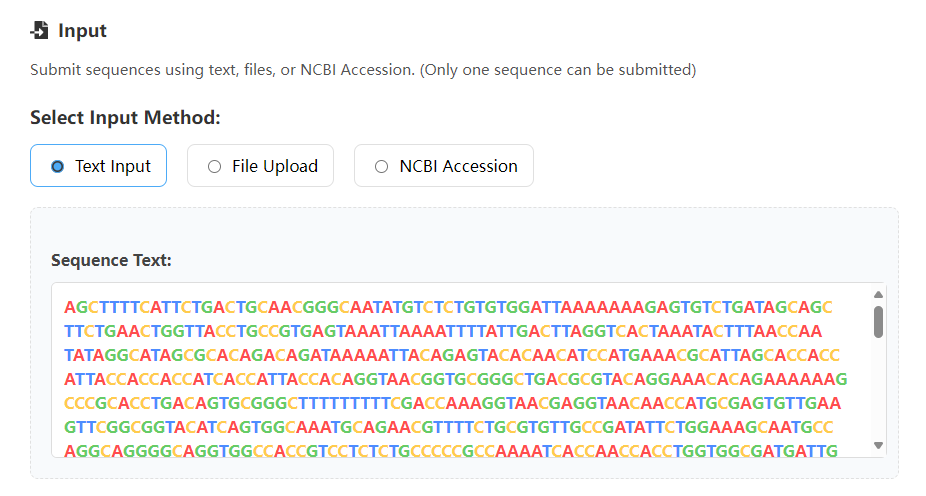
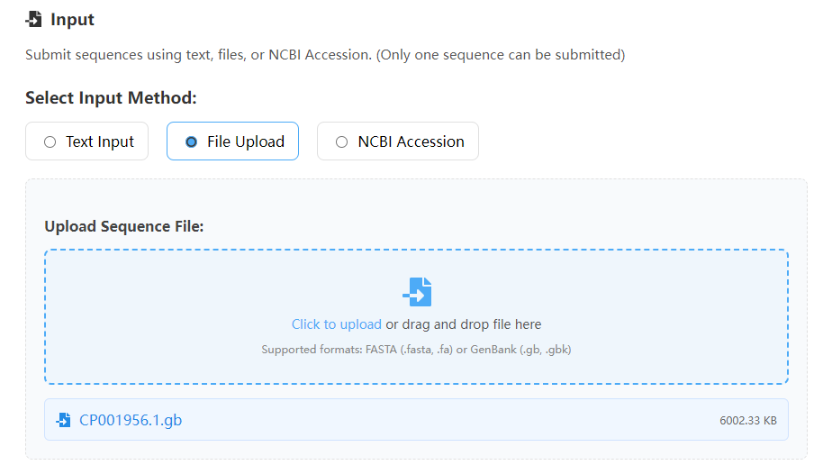
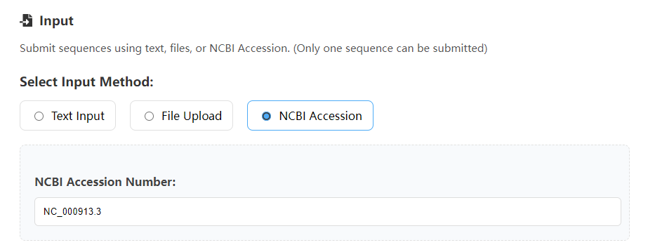
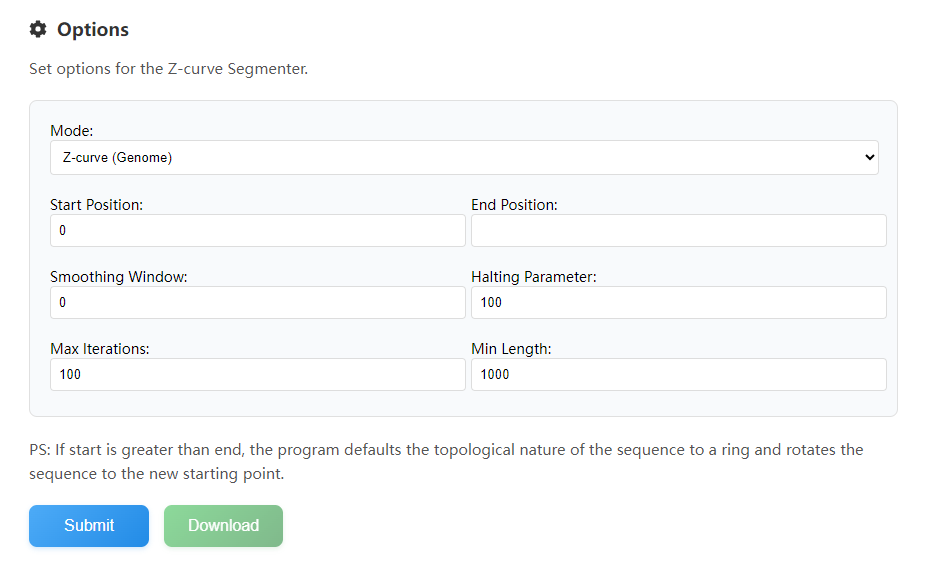
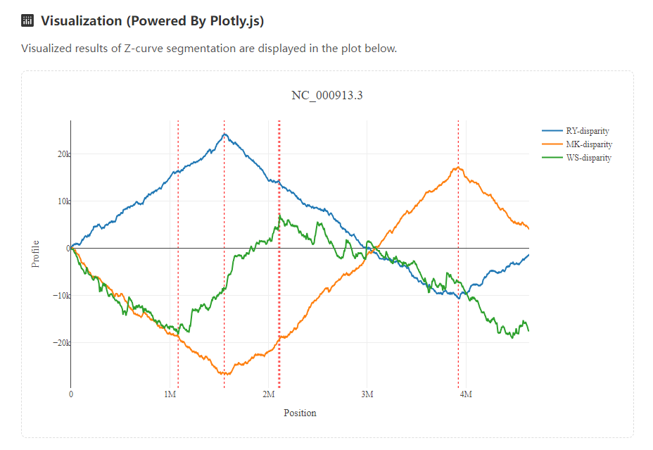
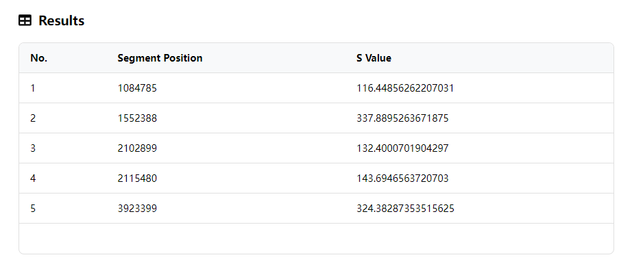

# Web Server
ZCurvePy Online Web Server is under construction. Once completed, it will be online at https://tubic.org/zcurvepy !

## Z-curve Segmenter

### Input
This Web application allows users to enter in three ways: plain text, file, and NCBI Accession. Either way, only one sequence can be entered. For example, if a user submits a file with multiple sequences, only the first sequence will be taken, and the rest, along with annotation information, will be ignored.
#### Text Input

The text input field can highlight the A, T, G, and C characters to help you determine the correctness of the input sequence, but only spaces, line feeds, tabs, and carriage returns are filtered out when submitted. Characters such as R, Y, M, K, W, S, B, D, H, V, U are processed normally, and other characters are treated as N (including N).  

#### File Input
Both FASTA and GenBank inputs are supported, but only one file can be uploaded. If the file contains multiple nucleic acid sequences, the back-end program will only process the first one. All annotations from GenBank will be ignored.  

#### Accession Input

Our program supports the online acquisition of sequences from NCBI, but please be careful to enter the correct Accession, not the protein sequence or assembly.  

### Options
Select and set the mode of segmentation and the parameters of the algorithm. The Z-curve segmentation method was based on genome order index, and it is a binary iterative algorithm. The segment points in each iteration are calculated by the following formula:  

$n_{\rm seg}={\rm argmax}\{S({\rm P}_n) + S({\rm Q}_n) - S({\rm P}_n + {\rm Q}_n)\},n=1,2,3...,N$

In the above formula, P represents the left subsequence at point $N$ of a dna sequence of length $n$, and Q represents the right subsequence. 
- **Mode**  
  We provide 7 ways to calculate S:

    | Segmentation Target | Order Index S(P)                | Application                         |
    |:-------------------:|:--------------------------------|:------------------------------------|
    |Z-curve              |$S({\rm P})=a^2+g^2+c^2+t^2$     |Replication Origin Recognition       |
    |RY disparity         |$S({\rm P})=(a^2+g^2)+(c^2+t^2)$ |Mitochondrial rRNA Region Search     |
    |MK disparity         |$S({\rm P})=(a^2+c^2)+(g^2+t^2)$ |Mitochondrial $\rm O_L$ Recognition  |
    |WS disparity         |$S({\rm P})=(a^2+t^2)+(g^2+c^2)$ |Genomic Island Search                |
    |AT disparity         |$S({\rm P})=a^2+t^2$             |                                     |
    |GC disparity         |$S({\rm P})=g^2+c^2$             |Leading/Lagging Chain search         |
    |CpG disparity        |$S({\rm P})=[p_n({\rm CpG})]^2+[1-p_n({\rm CpG})]^2$ |CpG Island Search|

- **Start Position**  
  The start position of the fragment [start, stop) to be segmented.  
  (The subscript starts at 0, as in most computer languages)

- **End Position**  
  The stop position of the fragment [start, stop) to be segmented.  
  (The subscript starts at 0, as in most computer languages)

    **Note**  
    If start is greater than end, the program defaults the topological nature of the sequence to a ring and rotates the sequence to the new starting point.

- **Smoothing Window**  
  The window size used for mean smoothing can reduce the graph sawtooth and make it more beautiful。

- **Halting Parameter**  
  In a round of iteration, if the $n_{seg}$ value of the target fragment is less than this value, the iteration stops.  

- **Max Iterations**  
  Maximum iterations. Prevents users from setting too small a halting parameter and getting stuck in infinite iterations.

- **Min Length**  
  The minimum distance between two segment points. Stop iteration when the distance is less than this.  

### Visualizaion

The results of the corresponding curve segmentation are visualized, so that users can adjust the parameters. With the powerful Plotly library, you can move, zoom, and hide curves to get the best picture possible. 

### Results  

Display segment results in tabular form. You can download it via the Download button. Use the Plotly control to save the image display.

